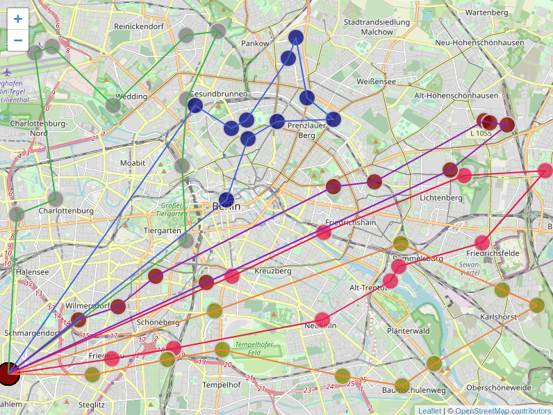

[](https://docs.rs/vrp-core)
[](https://crates.io/crates/vrp-cli)

[](https://crates.io/crates/vrp-core)
[](https://codecov.io/gh/reinterpretcat/vrp)
[](https://codescene.io/projects/46594)
[](https://deps.rs/crate/vrp-cli/1.23.0)
[](https://zenodo.org/badge/latestdoi/238436117)



# Description

This project provides the way to solve multiple variations of **Vehicle Routing Problem** known as rich VRP. It provides
custom hyper- and meta-heuristic implementations, shortly described [here](https://reinterpretcat.github.io/vrp/internals/index.html).

If you use the project in academic work, please consider citing:

```
@misc{builuk_rosomaxa_2023,
    author       = {Ilya Builuk},
    title        = {{A new solver for rich Vehicle Routing Problem}},
    year         = 2023,
    doi          = {10.5281/zenodo.4624037},
    publisher    = {Zenodo},
    url          = {https://doi.org/10.5281/zenodo.4624037}
}
```

# Design goal

Although performance is constantly in focus, the main idea behind design is extensibility: the project
aims to support a wide range of VRP variations known as Rich VRP. This is achieved through various extension
points: custom constraints, objective functions, acceptance criteria, etc.


# Getting started

For general installation steps and basic usage options, please check next sections. More detailed overview of features
and full description of the usage is presented in [A Vehicle Routing Problem Solver Documentation](https://reinterpretcat.github.io/vrp).

Probably, the easiest way to learn how to use the solver, would be to play with [interactive tutorial](https://github.com/reinterpretcat/vrp/tree/master/examples/python-interop/tutorial.ipynb),
written as jupyter notebook.

# Installation

You can install vrp solver using four different ways:

## Install with Python

The functionality of `vrp-cli` is published to [pypi.org](https://pypi.org/project/vrp-cli/), so you can just install it
using pip and use from python:

```shell
pip install vrp-cli
python examples/python-interop/example.py # run test example
```

Alternatively, you can use [maturin](https://github.com/PyO3/maturin) tool to build solver locally. You need to enable
`py_bindings` feature which is not enabled by default.

Additionally, to jupyter notebook mentioned above, you can find extra information in [python example section](https://reinterpretcat.github.io/vrp/examples/interop/python.html)
of the docs. The [full source code](./examples/python-interop/example.py) of python example is available in the repo which
contains useful model wrappers with help of `pydantic` lib (reused by tutorial as well).


## Install from Docker

Another fast way to try vrp solver on your environment is to use `docker` image (not performance optimized):

* **run public image** from `Github Container Registry`:

```bash
    docker run -it -v $(pwd):/repo --name vrp-cli --rm ghcr.io/reinterpretcat/vrp/vrp-cli:1.23.0
```

* **build image locally** using `Dockerfile` provided:

```bash
docker build -t vrp_solver .
docker run -it -v $(pwd):/repo --rm vrp_solver
```

Please note that the docker image is built using `musl`, not `glibc` standard library. So there might be some performance
implications.


## Install from Cargo

You can install vrp solver `cli` tool directly with `cargo install`:

    cargo install vrp-cli

Ensure that your `$PATH` is properly configured to source the crates binaries, and then run solver using the `vrp-cli` command.


## Install from source

Once pulled the source code, you can build it using `cargo`:

    cargo build --release

Built binaries can be found in the `./target/release` directory.

Alternatively, you can try to run the following script from the project root:

    ./solve_problem.sh examples/data/pragmatic/objectives/berlin.default.problem.json

It will build the executable and automatically launch the solver with the specified VRP definition. Results are
stored in the folder where a problem definition is located.


# Usage

You can use vrp solver either from command line or from code:

## Use from command line

`vrp-cli` crate is designed to use on problems defined in scientific or custom json (aka `pragmatic`) format:

    vrp-cli solve pragmatic problem_definition.json -m routing_matrix.json --max-time=120

Please refer to [getting started](https://reinterpretcat.github.io/vrp/getting-started/index.html) section in
the documentation for more details.

## Use from code

If you're using rust, then you can simply use `vrp-scientific`, `vrp-pragmatic` crates to solve VRP problem
defined in `pragmatic` or `scientific` format using default metaheuristic. For more complex scenarios, please refer to
`vrp-core` documentation.

If you're using some other language, e.g. java, kotlin, javascript, python, please check
[interop](https://reinterpretcat.github.io/vrp/examples/interop/index.html) section in documentation examples to see how
to call the library from it.

# Contribution policy

*open source, limited contribution*

The goal is to reduce burnout by limiting the maintenance overhead of reviewing and validating third-party code.

Please submit an [issue](https://github.com/reinterpretcat/vrp/issues/new) or [discussion](https://github.com/reinterpretcat/vrp/discussions/new/choose)
if you have ideas for improvement.

# Status

Experimental.
