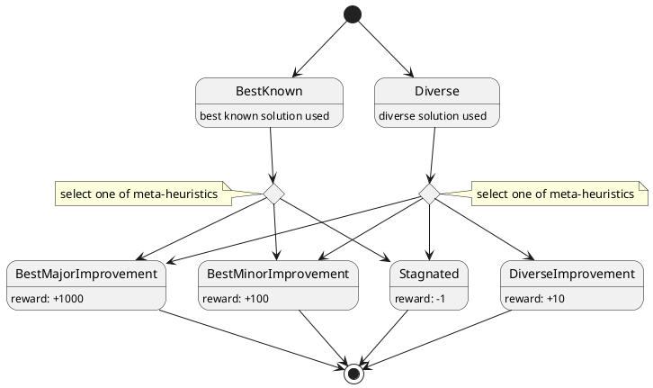

# Hyper-heuristic

By default, the solver tries to use the dynamic hyper-heuristic which uses [Markov Decision Process](https://en.wikipedia.org/wiki/Markov_decision_process)
mechanism to choose one of pre-defined meta-heuristics on each solution refinement step.

