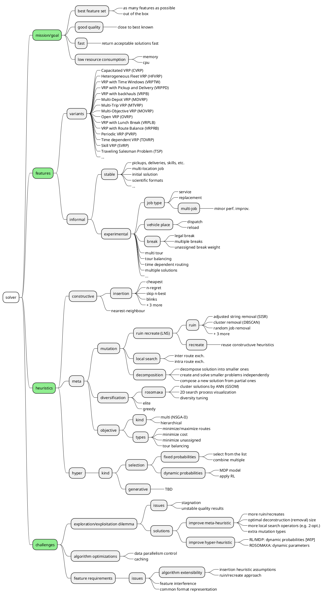

# Overview

Mind map which describes in short project's goals, used algorithms, and challenges.

```plantuml
@startmindmap
<style>
mindmapDiagram {
    :depth(1) {
      BackGroundColor lightGreen
    }
}
</style>

*[#white] solver

right side
 * mission/goal
  * best feature set
   *_ as many features as possible
   *_ out of the box
  * good quality
   *_ close to best known
  * fast
   *_ return acceptable solutions fast
  * low resource consumption
   *_ memory
   *_ cpu


 * features
  * variants
   *_ Capacitated VRP (CVRP)
   *_ Heterogeneous Fleet VRP (HFVRP)
   *_ VRP with Time Windows (VRPTW)
   *_ VRP with Pickup and Delivery (VRPPD)
   *_ VRP with backhauls (VRPB)
   *_ Multi-Depot VRP (MDVRP)
   *_ Multi-Trip VRP (MTVRP)
   *_ Multi-Objective VRP (MOVRP)
   *_ Open VRP (OVRP)
   *_ VRP with Lunch Break (VRPLB)
   *_ VRP with Route Balance (VRPRB)
   *_ Periodic VRP (PVRP)
   *_ Time dependent VRP (TDVRP)
   *_ Skill VRP (SVRP)
   *_ Traveling Salesman Problem (TSP)
   *_ ...

  * informal
   * stable
    *_ pickups, deliveries, skills, etc.
    *_ multi-location job
    *_ initial solution
    *_ scientific formats
    *_ ...
   * experimental
    * job type
     *_ service
     *_ replacement
     * multi-job
      *_ minor perf. improv.
    * vehicle place
     *_ dispatch
     *_ reload
    * break
     *_ legal break
     *_ multiple breaks
     *_ unassigned break weight
    *_ multi tour
    *_ tour balancing
    *_ time dependent routing
    *_ multiple solutions
    *_ ...


 * heuristics

  * constructive
   * insertion
    *_ cheapest
    *_ n-regret
    *_ skip n-best
    *_ blinks
    *_ + 3 more    
   *_ nearest-neighbour

  * meta

   * mutation
    * ruin recreate (LNS)
     * ruin
      *_ adjusted string removal (SISR)
      *_ cluster removal (DBSCAN)
      *_ random job removal
      *_ + 3 more
     * recreate
      *_ reuse constructuve heuristics
    * local search
     *_ inter route exch.
     *_ intra route exch.
    * decomposition
     *_ decompose solution into smaller ones
     *_ create and solve smaller problems independently
     *_ compose a new solution from partial ones

   * diversification
    * rosomaxa
     *_ cluster solutions by ANN (GSOM)
     *_ 2D search process visualization
     *_ diversity tuning
    *_ elite
    *_ greedy

   * objective
    * kind
     *_ multi (NSGA-II)
     *_ hierarchical
    * types
     *_ minimize/maximize routes
     *_ minimize cost
     *_ minimize unassigned
     *_ tour balancing

  * hyper
   * kind
    * selection
     * fixed probabilities
      *_ select from the list
      *_ combine multiple
 
     * dynamic probabilities
      *_ MDP model
      *_ apply RL

    * generative
     *_ TBD

 * challenges
  * exploration/exploitation dilemma
   * issues
    *_ stagnation
    *_ unstable quality results
   * solutions
    * improve meta-heuristic
     *_ more ruin/recreates
     *_ optimal deconstruction (removal) size
     *_ more local search operators (e.g. 2-opt.)
     *_ extra mutation types
    * improve hyper-heuristic
     *_ RL/MDP: dynamic probabilities [WIP]
     *_ ROSOMAXA: dynamic parameters

  * algorithm optimizations
   *_ data parallelism control
   *_ caching

  * feature requirements
   * issues
    * algorithm extensibility
     *_ insertion heuristic assumptions
     *_ ruin/recreate approach
    *_ feature interference
    *_ common format representation

@endmindmap
```